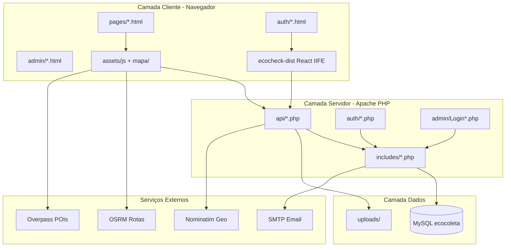
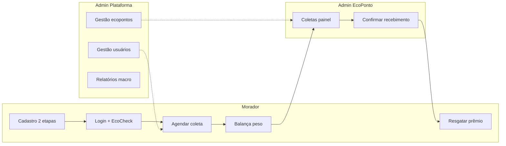

# EcoColeta — Documentação de Apresentação (Índice Geral)

> **Versão expandida** para apresentação acadêmica completa (banca, TCC, projeto integrador).  
> **Público:** professor avaliador · **Formato:** roteiro oral + referência técnica enciclopédica.

---

## Como usar este material

Este conjunto foi dividido em **4 volumes** para facilitar estudo e apresentação. Leia na ordem ou consulte por módulo.

| Volume | Arquivo | Conteúdo | Tempo oral sugerido |
|--------|---------|----------|-------------------|
| **1** | [APRESENTACAO-MEGA-VOL1-INTRO-ARQUITETURA.md](./APRESENTACAO-MEGA-VOL1-INTRO-ARQUITETURA.md) | Objetivo, arquitetura, stack, diagramas, pastas, BD, sessões | 15–20 min |
| **2** | [APRESENTACAO-MEGA-VOL2-CODIGO-BACKEND.md](./APRESENTACAO-MEGA-VOL2-CODIGO-BACKEND.md) | Todo `api/`, `auth/`, `admin/*.php`, `includes/` — cada arquivo e função | 25–35 min |
| **3** | [APRESENTACAO-MEGA-VOL3-FRONTEND-MAPAS.md](./APRESENTACAO-MEGA-VOL3-FRONTEND-MAPAS.md) | `pages/`, `assets/js/`, `admin/*.html+js`, EcoCheck React, mapa | 20–25 min |
| **4** | [APRESENTACAO-MEGA-VOL4-FLUXOS-ROTEIRO-ORAL.md](./APRESENTACAO-MEGA-VOL4-FLUXOS-ROTEIRO-ORAL.md) | Fluxos E2E, APIs externas, regras de negócio, QA, demo 90 min, glossário | 25–35 min |

**Tempo total da apresentação completa:** 85–115 minutos (inclui demonstração ao vivo).

---

## Resumo executivo (fale isto em 60 segundos)

> O **EcoColeta** é uma plataforma web de coleta seletiva gamificada para o Cariri (CE). Moradores cadastram-se com verificação de e-mail, agendam coletas, informam peso na balança virtual e acumulam **EcoPoints** após validação do ecoponto parceiro. Os pontos são trocados por cupons de parceiros locais. A plataforma oferece mapa com rotas OSRM, ranking por rua, relatórios ambientais, anti-bot EcoCheck em React, e dois painéis administrativos: **plataforma** (macro) e **ecoponto** (operação). Backend em PHP 8 + MySQL; frontend HTML/JS; ~500 arquivos; testes automatizados de 42 páginas e 50+ checks de integração.

---

## Estatísticas do projeto

| Métrica | Valor aproximado |
|---------|------------------|
| Arquivos de código (php, js, html, tsx, css, sql) | ~500 |
| Endpoints JSON em `api/` | ~45 ativos |
| Páginas HTML morador | 16 |
| Páginas HTML auth | 10 |
| Páginas HTML admin | 15 |
| Funções em `includes/pontuacao-coleta.php` | 18 |
| Funções em `includes/admin-ecoponto-data.php` | 60+ |
| Tabelas MySQL (schema + migrações) | 20+ |
| Moradores seed | 50 (`@seed.ecocoleta.local`) |
| Prêmios seed | 20 benefícios |
| EcoPontos seed | catálogo Cariri |

---

## Credenciais de demonstração

| Perfil | E-mail | Senha |
|--------|--------|-------|
| Morador seed | `ana.paula.ferreira@seed.ecocoleta.local` | `Morador@123` |
| Admin plataforma | `admin.plataforma@ecocoleta.local` | `EcoPlat@2026` |
| Admin ecoponto | `admin.ecoponto@ecocoleta.local` | `EcoPonto@123` |

---

## Diagrama de arquitetura (desenhe no quadro)

---

## Mapa mental dos fluxos principais

---

## Checklist antes da apresentação

- [ ] XAMPP: Apache + MySQL rodando
- [ ] Banco `ecocoleta` instalado (`config/INSTALAR-BANCO.bat`)
- [ ] Seed opcional: `php database/seed_usuarios.php`
- [ ] EcoCheck build: `cd ecocheck && npm run build`
- [ ] URL: `http://localhost/Ecocoleta/`
- [ ] Abrir no editor: `includes/pontuacao-coleta.php`, `api/agendamento_coleta.php`, `ecocheck/src/components/PuzzleSlider.tsx`
- [ ] Rodar QA: `php config/qa-integracao-fluxos.php` (mostrar 0 falhas)
- [ ] SMTP: explicar `modo_local_sem_email` se sem Gmail configurado

---

## Documentos complementares no repositório

| Documento | Conteúdo |
|-----------|----------|
| `docs/PERFORMANCE-REPORT.md` | Lazy loading, cache, otimizações |
| `docs/QA-RELATORIO-CAIXAS-PRETA-BRANCA.md` | 42/42 páginas HTML |
| `docs/QA-INTEGRACAO-FLUXOS.md` | Fluxos E2E automatizados |
| `database/SEED-USUARIOS.md` | Moradores fictícios |
| `config/COMO_RODAR.txt` | Instalação XAMPP |
| `README.md` | Visão geral e estrutura |

---

*Índice gerado para apresentação acadêmica do EcoColeta — consulte os 4 volumes para o roteiro completo.*
