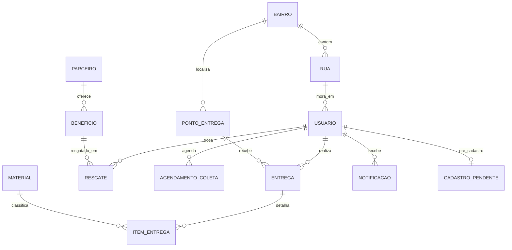

# Volume 1 — Introdução, Objetivo, Arquitetura e Banco de Dados

---

# SEÇÃO 1 — ABERTURA FORMAL (roteiro oral)

**[Slide 1 — Título]**

> “Professor(a) e colegas, apresento o **EcoColeta**, sistema web desenvolvido como solução integrada para **gestão de coleta seletiva com gamificação**, voltado à região do **Cariri cearense** (Juazeiro do Norte, Crato, Barbalha, Missão Velha e adjacências).
>
> O problema que motivou o projeto é a **baixa adesão ao descarte correto** e a **falta de ferramentas digitais** que conectem morador, ponto de coleta e gestão pública/parceira em um único fluxo rastreável.
>
> A proposta responde com: cadastro verificado, agendamento, validação de peso, pontuação justa, mapa com rotas, prêmios e painéis administrativos em dois níveis.”

**[Pausa — mostrar `pages/tela-inicia.html` no navegador]**

---

# SEÇÃO 2 — OBJETIVO GERAL E OBJETIVOS ESPECÍFICOS

## 2.1 Objetivo geral

**O que dizer:**

> “Desenvolver uma plataforma web que **incentive e registre** práticas de coleta seletiva, transformando comportamento ambiental em **métricas mensuráveis** (peso, material, pontos) e **recompensas tangíveis** (cupons).”

## 2.2 Objetivos específicos (fale um por um)

| # | Objetivo específico | Onde está no código |
|---|---------------------|---------------------|
| 1 | Permitir cadastro e autenticação segura com verificação de e-mail | `auth/cadastro.php`, `auth/verificar_cadastro.php`, `auth/login.php` |
| 2 | Implementar proteção anti-bot em formulários sensíveis | `ecocheck/`, `api/ecocheck-api.php` |
| 3 | Agendar coletas com validação de endereço e material | `api/agendamento_coleta.php`, `includes/ecoponto-agendamento.php` |
| 4 | Simular e validar peso na balança com regras anti-fraude | `pages/balanca-ecoponto.html`, `includes/pontuacao-coleta.php` |
| 5 | Creditar pontos somente após confirmação administrativa | `api/adm-coletas.php` → `coleta_confirmar_recebimento_admin()` |
| 6 | Permitir resgate de prêmios com débito transacional | `api/resgate_premio.php` |
| 7 | Exibir mapa com geolocalização e rotas | `mapa/mapa.js`, `mapa/route-service.js` |
| 8 | Oferecer painel macro (plataforma) e operacional (ecoponto) | `admin/Home-ADM.html`, `admin/Coletas-ADM-Ecoponto.html` |
| 9 | Gerar relatórios e ranking por rua | `api/ranking-ruas.php`, `pages/Ranking.html` |
| 10 | Garantir qualidade com testes automatizados | `config/qa-all-pages.ps1`, `config/qa-integracao-fluxos.php` |

---

# SEÇÃO 3 — JUSTIFICATIVA E CONTRIBUIÇÃO ACADÊMICA

**O que dizer:**

> “Do ponto de vista acadêmico, o projeto demonstra:
>
> - **Engenharia de software** com separação em camadas (apresentação, negócio, dados).
> - **Segurança de aplicações web**: hash de senha, sessão, anti-bot, prepared statements.
> - **Integração de APIs REST de terceiros** (OpenStreetMap ecosystem).
> - **Modelagem relacional** com integridade referencial e transações.
> - **UX progressiva**: lazy loading, feedback em tempo real, notificações.
> - **Testabilidade**: scripts QA caixa preta e branca documentados em `docs/`.”

---

# SEÇÃO 4 — ARQUITETURA DETALHADA

## 4.1 Padrão arquitetural

**O que dizer:**

> “Adotamos arquitetura **cliente-servidor em três camadas**, sem framework MVC completo, por três razões pedagógicas e práticas:
>
> 1. **Transparência didática** — cada request mapeia para um arquivo PHP visível.
> 2. **Compatibilidade XAMPP** — deploy em ambiente LAMP/WAMP sem Composer obrigatório além do PHPMailer.
> 3. **Modularidade** — regras de negócio concentradas em `includes/`, evitando duplicação entre `api/` e `auth/`.”

## 4.2 Camadas expandidas

### Camada 1 — Apresentação (Cliente)

| Tecnologia | Papel | Arquivos |
|------------|-------|----------|
| HTML5 semântico | Estrutura das telas | `pages/`, `auth/`, `admin/` |
| CSS3 | Identidade visual, responsividade | `assets/css/`, `admin/*.css` |
| JavaScript ES6+ | Lógica UI, fetch, DOM | `assets/js/`, `admin/*.js`, `mapa/` |
| React 18 (subset) | Widget EcoCheck + transport widget | `ecocheck/src/`, `transport-times-widget.js` |
| Leaflet 1.9 | Mapas interativos | CDN + `mapa/mapa.js` |

**Padrão de comunicação:** `fetch()` com `Content-Type: application/x-www-form-urlencoded` ou `multipart/form-data`; resposta sempre JSON com `{ sucesso: boolean, ... }`.

### Camada 2 — Aplicação (Servidor PHP)

| Componente | Papel |
|------------|-------|
| **Roteadores finos** (`api/*.php`) | Validar método HTTP, sessão, delegar |
| **Controladores auth** (`auth/*.php`) | Login, cadastro, recuperação |
| **Controladores admin** (`admin/Login*.php`) | Login administrativo |
| **Domínio** (`includes/*.php`) | Regras, SQL complexo, notificações |
| **EcoCheck lib** (`ecocheck/ecocheck-lib.php`) | Anti-bot servidor |

### Camada 3 — Dados

| Componente | Papel |
|------------|-------|
| MySQL 8 / MariaDB | Persistência relacional |
| `includes/conexao.php` | Pool único `$conn` mysqli |
| `uploads/` + `api/uploads/` | Blobs de imagem (avatar) |
| `$_SESSION` | Estado de autenticação server-side |

## 4.3 Modelo de deploy

```
C:\xampp\htdocs\Ecocoleta\
    ↓ Apache escuta porta 80
    ↓ mod_rewrite (.htaccess)
    ↓ PHP interpreta .php
    ↓ mysqli → MySQL porta 3306
```

**O que dizer sobre `.htaccess`:**

> “O `.htaccess` cumpre quatro papéis: define `DirectoryIndex`, bloqueia acesso a `conexao.config.php` e `.sql`, aplica headers `X-Frame-Options` e `nosniff`, configura cache de assets com `?v=` para bust, e reescreve **dezenas de URLs legadas** — por exemplo `/login.html` vira `/auth/login.html` — para não quebrar bookmarks após a reorganização em pastas.”

---

# SEÇÃO 5 — ESTRUTURA DE PASTAS (DETALHAMENTO POR PASTA)

## 5.1 Raiz do projeto

| Arquivo | Finalidade detalhada |
|---------|---------------------|
| `index.html` | Redireciona para `pages/tela-inicia.html` |
| `composer.json` | Declara dependência `phpmailer/phpmailer ^7.0` |
| `.htaccess` | Rewrites, segurança, cache (~150 linhas) |
| `README.md` | Documentação de instalação |

## 5.2 `pages/` — Portal do morador (16 páginas)

Cada página é **autocontida em HTML** mas compartilha header/footer via JS.

| Arquivo | Conteúdo da tela | Dependências JS/CSS |
|---------|------------------|---------------------|
| `tela-inicia.html` | Hero, missão, mapa embutido, seção ecopontos | `home.css`, `mapa/mapa.js`, Leaflet CDN |
| `agendar-coleta.html` | Calendário mensal, slots 0–4, seleção material | `agendar-coleta.js`, `agendar-coleta.css` |
| `formulario-coleta.html` | Variante unificada agendamento + estilo balança | `agendar-coleta.js` |
| `balanca-ecoponto.html` | Seleção de materiais, input peso, estimativa pontos | `balanca-ecoponto.js`, `pontuacao-coleta.js` |
| `perfil.html` | Avatar, nível, saldo, gráficos atividade | `perfil.js`, `perfil.css` |
| `edicaoperfil.html` | Form edição nome, e-mail, endereço, senha, foto | `edicaoperfil.js`, `edicaoperfil.css` |
| `ecopontos.html` | Mapa fullscreen dos PEVs | `ecopontos.js`, `mapa/mapa.js` |
| `premios-disponiveis.html` | Grid de benefícios, botão resgatar | `premios.js`, `premios.css` |
| `Ranking.html` | Leaderboard ruas semana/mês | `ranking.js`, `ranking.css` |
| `pagina-relatorio.html` | Gerador relatório pessoal PDF/print | `ecocoleta-export.js` |
| `relatorio-mensal.html` | Visualização mensal | export helpers |
| `notif-popup.html` | Partial do popup de notificações | incluído via fetch |
| `como-funciona.html` | Conteúdo institucional | `como-funciona.css` |
| `quem-somos.html` | Sobre o projeto | estático |
| `educacao-ambiental.html` | Conteúdo educativo | estático |
| `mapa.html` | Redirect para anchor na home | meta refresh |

## 5.3 `auth/` — Autenticação (10 HTML + 8 PHP)

| Arquivo | Tipo | Papel |
|---------|------|-------|
| `login.html` | View | Form e-mail/senha + EcoCheck lazy |
| `login.php` | Controller | Autentica morador, JSON |
| `cadastro.html` | View | Form nome/e-mail/senha |
| `cadastro.php` | Controller | Grava `cadastro_pendente`, envia código |
| `verificar-cadastro.html` | View | Input 6 dígitos |
| `verificar_cadastro.php` | Controller | Cria `usuario` |
| `recuperar.html` | View | Solicita código reset |
| `recuperar.php` | Controller | Envia código + valida código (mesmo arquivo) |
| `verificacao.html` | View | Digita código recebido |
| `nova-senha.html` | View | Nova senha com regras visuais |
| `resetar_senha.php` | Controller | Persiste hash nova senha |
| `senha-criada.html` | View | Confirmação sucesso |
| `resetar.html` | View | Alias fluxo reset |
| `login-temp.html` | View | Aviso login temporariamente desabilitado |

## 5.4 `api/` — Camada REST (~45 endpoints ativos)

Organização por **um arquivo = um domínio**. Ver Volume 2 para catálogo completo com parâmetros.

## 5.5 `includes/` — Biblioteca de domínio (~35 arquivos)

Coração do sistema. Ver Volume 2.

## 5.6 `admin/` — Painéis (15 HTML + ~30 JS/CSS)

Dois produtos distintos na mesma pasta:

- **Plataforma** (`Home-ADM`, prefixo `plat-` nos assets)
- **EcoPonto** (`Home-ADM-Ecoponto`, prefixo `adm-ecoponto-`)

## 5.7 `database/` — Persistência

| Arquivo | Quando usar |
|---------|-------------|
| `instalar_ecocoleta.sql` | Instalação completa do zero |
| `SQL_BDD_EcoColeta.sql` | Schema acadêmico original |
| `revisar_ecocoleta.sql` | Migração colunas em BD existente |
| `premios_beneficios_resgate.sql` | 20 prêmios seed |
| `agendamento_coleta_tab.sql` | Tabela agendamento morador |
| `cadastro_pendente_tab.sql` | Cadastro 2 etapas |
| `notificacao_tab.sql` | Sistema de alertas |
| `seed_usuarios.php` | CLI: 50 moradores Cariri |
| `seed_ecopontos.php` | CLI: ecopontos no mapa |

## 5.8 `ecocheck/` e `ecocheck-dist/`

| Pasta | Conteúdo |
|-------|----------|
| `ecocheck/src/` | Fonte TypeScript/React |
| `ecocheck/package.json` | React 18, Vite, TypeScript |
| `ecocheck-dist/` | `ecocheck.iife.js` + `ecocheck.css` consumidos pelo site |

## 5.9 `mapa/` — Módulo geoespacial

11 arquivos: motor de mapa, rotas, navegação turn-by-turn, consentimento GPS.

## 5.10 `config/` — Operações

Scripts PowerShell/BAT para XAMPP, QA, reorganização, diagnóstico porta 80.

---

# SEÇÃO 6 — BANCO DE DADOS (MODELAGEM COMPLETA)

## 6.1 Diagrama entidade-relacionamento



## 6.2 Tabelas do schema base (`SQL_BDD_EcoColeta.sql`)

### `bairro`
- **PK:** `id_bairro`
- **Campos:** `nome_bairro`
- **Uso:** Normalização geográfica; ranking por rua agrega por bairro

### `rua`
- **PK:** `id_rua` · **FK:** `id_bairro`
- **Uso:** Endereço do morador (`usuario.id_rua`); ranking por rua

### `usuario`
- **PK:** `id_usuario`
- **Campos principais:** `nome`, `email` UNIQUE, `senha_hash`, `tipo_usuario` ENUM, `id_rua`
- **Campos de recuperação:** `codigo_recuperacao_hash`, `reset_token`
- **Colunas adicionadas por migração:** `telefone`, `foto_perfil`, `saldo_ecopoints`, `ocorrencias_divergencia_peso`, `conta_em_revisao`
- **Regra:** senha sempre `password_hash()` PASSWORD_DEFAULT

### `ponto_entrega` (EcoPonto / PEV)
- **PK:** `id_pev`
- **Campos:** `nome_ponto`, `endereco`, `id_bairro`
- **Migração:** latitude, longitude, materiais aceitos JSON

### `material` + `item_entrega`
- Detalhamento por tipo na entrega (plástico, papel, vidro…)

### `entrega` — **registro oficial de pontos**
- **PK:** `id_entrega`
- **Campos:** `peso_total`, `pontos_gerados`, `id_usuario`, `id_pev`, `data_entrega`
- **Migração:** `id_agendamento`, `responsavel`, `status_material`
- **Regra crítica:** só criada por `coleta_confirmar_recebimento_admin()`

### `beneficio` + `resgate`
- Prêmios com `pontos_necessarios` e `codigo_cupom`
- `resgate` armazena `pontos_utilizados` — débito histórico

## 6.3 Tabelas de migração (essenciais ao fluxo atual)

### `agendamento_coleta_morador`
| Coluna | Significado |
|--------|-------------|
| `id_agendamento` | PK |
| `id_usuario` | Morador |
| `data_coleta` | DATE |
| `slot_ordem` | 0–4 (faixas horárias) |
| `status_coleta` | pendente → aguardando_validacao → concluida |
| `id_pev` | EcoPonto destino |
| `tipo_residuo` | CSV de materiais |
| `peso_pendente_kg` | Peso informado na balança |
| `pontos_estimados` | Preview (não é saldo real) |
| `peso_status` | pendente / validado |

### `cadastro_pendente`
- Armazena cadastro até confirmar e-mail (código 6 dígitos, expiração)

### `notificacao`
- `id_usuario`, `titulo`, `mensagem`, `lida`, `tipo`, `ref_id`

### `administrador_ecoponto` / `administrador_plataforma`
- Credenciais admin separadas da tabela `usuario`

## 6.4 Cálculo do saldo EcoPoints

**O que dizer:**

> “O saldo é derivado de **entregas confirmadas** menos **resgates**, com função `ecocoleta_obter_saldo_usuario()` em `includes/stmt_helpers.php`. Se existir coluna `saldo_ecopoints` em `usuario`, o sistema sincroniza com o maior valor entre coluna e cálculo — garantindo consistência após resgate transacional.”

---

# SEÇÃO 7 — SESSÕES E AUTENTICAÇÃO (VISÃO GERAL)

## 7.1 Três universos de sessão PHP

| Universo | Variáveis `$_SESSION` | Guard | Logout |
|----------|----------------------|-------|--------|
| Morador | `usuario_id`, `usuario_nome`, `usuario_email` | Checagem em cada API | `api/logout.php` |
| Plataforma | `ecocoleta_plat_admin_id`, `_nome`, `_email`, `_cargo` | `ecoplat_exigir_sessao()` | `admin/admin-plataforma-session.php` |
| EcoPonto | `ecoponto_admin_id`, `_id_pev`, `_nome_ecoponto` | `ecoadm_exigir_sessao()` | `admin/admin-ecoponto-session.php` |

## 7.2 EcoCheck — camada pré-autenticação

Antes de qualquer login POST, o cliente deve possuir `ecocheck_verified_token` na sessão.

**Fluxo:**
1. GET `api/ecocheck-api.php?action=challenge` → imagens puzzle + `challengeId`
2. Usuário arrasta slider (`PuzzleSlider.tsx`)
3. POST `action=verify` com `positionX`, `durationMs`, `sampleCount`, métricas
4. Servidor valida → retorna `token` → sessão

**Funções servidor (`ecocheck-lib.php`):**
- `ecocheck_criar_desafio()` — gera puzzle GD ou SVG
- `ecocheck_verificar_desafio()` — valida posição e comportamento
- `ecocheck_exigir_token()` — aborta com JSON erro se inválido

---

# SEÇÃO 8 — TECNOLOGIAS (TABELA EXPANDIDA)

| Categoria | Tecnologia | Versão | Justificativa |
|-----------|------------|--------|---------------|
| Linguagem servidor | PHP | 8.x | Amplamente suportado em XAMPP |
| Banco | MySQL | 5.7+ / 8 | Relacional, ACID para resgate |
| Servidor web | Apache | 2.4 | mod_rewrite, .htaccess |
| E-mail | PHPMailer | 7.x | SMTP Gmail/custom |
| Mapa | Leaflet | 1.9.4 | Open source, leve |
| Rotas | OSRM | API pública | Cálculo de rotas reais |
| POIs | Overpass | API DE | Dados OSM reciclagem |
| Geocode | Nominatim + Photon | APIs OSM/Komoot | Endereço → coordenadas |
| Anti-bot UI | React + Vite | 18 / 5 | Componente puzzle moderno |
| JS cliente | ES6 modules pattern | — | Sem bundler no site principal |
| Testes | PowerShell + PHP CLI | — | QA automatizado Windows/XAMPP |

---

# SEÇÃO 9 — TRANSIÇÃO PARA O VOLUME 2

**O que dizer ao encerrar este bloco:**

> “Até aqui apresentei o **problema**, os **objetivos**, a **arquitetura em camadas**, a **estrutura de pastas**, o **modelo de dados** e o **modelo de sessão**.
>
> No próximo bloco, entro no **código do backend**: cada arquivo PHP em `api/`, `auth/`, `admin/` e cada função relevante em `includes/` — com parâmetros, respostas JSON e regras associadas.”

**[Abrir:** `docs/APRESENTACAO-MEGA-VOL2-CODIGO-BACKEND.md`]

---

*Fim do Volume 1*
