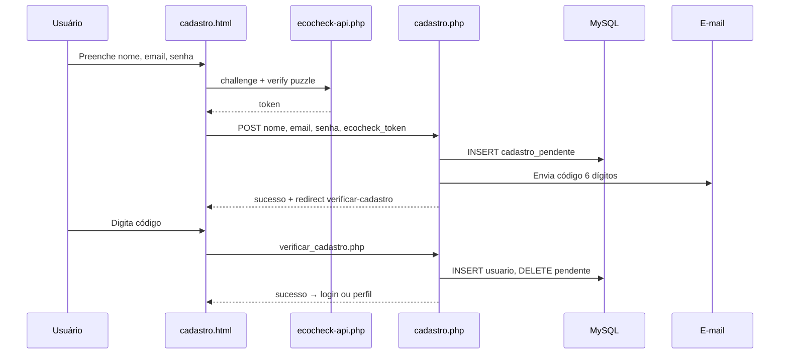
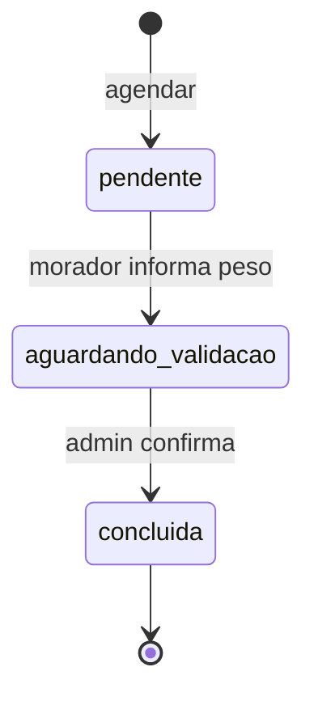

# Volume 4 — Fluxos E2E, Regras de Negócio, QA, Roteiro Oral 90 min e Glossário

---

# PARTE A — FLUXOS COMPLETOS (SEQUÊNCIA PASSO A PASSO)

---

## FLUXO 1 — Cadastro de morador (E2E)



### Roteiro oral deste fluxo (2 min)

> 1. “O usuário acessa `auth/cadastro.html`.”
> 2. “Ao enviar, o **EcoCheck** exige resolver o puzzle — prova que não é bot.”
> 3. “`cadastro.php` **não cria** o usuário ainda; grava em `cadastro_pendente`.”
> 4. “Um código de **6 dígitos** vai por e-mail — ou aparece na tela em modo dev.”
> 5. “`verificar-cadastro.html` envia o código; `verificar_cadastro.php` cria o registro em `usuario`.”
> 6. “O `sessionStorage` guarda `signupEmail` para a etapa 2 não perder o contexto.”

---

## FLUXO 2 — Login morador

| Passo | Componente | Dado |
|-------|------------|------|
| 1 | `login.html` | UI formulário |
| 2 | `ecocheck-bridge.js` | Abre modal React |
| 3 | `api/ecocheck-api.php` | Token sessão |
| 4 | `auth/login.php` | Valida credenciais |
| 5 | `$_SESSION` | `usuario_id` |
| 6 | Redirect | `perfil.html` ou URL `?next=` |

**Regra:** sem EcoCheck token → JSON `{ erro: "Verificação anti-bot..." }`

---

## FLUXO 3 — Agendamento de coleta

| Passo | Quem | Ação |
|-------|------|------|
| 1 | Morador | Abre `agendar-coleta.html` |
| 2 | JS | Verifica login via `meu_perfil.php` |
| 3 | JS | GET `ecopontos-agendamento.php` |
| 4 | PHP | `ecoponto_coords_usuario` + Haversine |
| 5 | Morador | Escolhe data, slot, materiais |
| 6 | JS | POST `agendamento_coleta.php` acao=agendar |
| 7 | PHP | Valida endereço, PEV, material |
| 8 | DB | INSERT `agendamento_coleta_morador` |
| 9 | PHP | `ecocoleta_notif_agendamento` + notif admins |
| 10 | UI | Confirmação com faixa horário |

**Slots horários (`slot_ordem`):**

| slot | Faixa (exemplo) |
|------|-----------------|
| 0 | 08:00 – 10:00 |
| 1 | 10:00 – 12:00 |
| 2 | 13:00 – 15:00 |
| 3 | 15:00 – 17:00 |
| 4 | 17:00 – 19:00 |

---

## FLUXO 4 — Balança (morador → admin → pontos)

| Etapa | status_coleta | Quem | Endpoint |
|-------|---------------|------|----------|
| A | `pendente` | Sistema | agendar com `somente_pendente=1` |
| B | `aguardando_validacao` | Morador | `atualizar_balanca` |
| C | `concluida` | Admin | `confirmar_recebimento` |
| D | — | Sistema | INSERT `entrega`, saldo += pontos |



### Divergência de peso (matriz de negócio)

| Diferença % | Decisão | Efeito nos pontos |
|-------------|---------|-------------------|
| ≤ 10% | Auto aprovado | 100% pontos calculados |
| ≤ 30% | Aprovado com aviso | 100% + notificação divergência |
| > 30% 1ª vez | Advertência | 100% + registra ocorrência |
| > 30% 2ª vez | Redução 20% | `coleta_aplicar_penalidade_pontos` |
| > 30% 3ª vez | Zero pontos | Pontos = 0 |
| > 30% 4ª+ | Revisão conta | `conta_em_revisao = 1` |

---

## FLUXO 5 — Resgate de prêmio

| Passo | Verificação |
|-------|-------------|
| 1 | Sessão morador |
| 2 | `saldo >= beneficio.pontos_necessarios` |
| 3 | Não existe `resgate` prévio mesmo benefício |
| 4 | BEGIN TRANSACTION |
| 5 | INSERT `resgate` |
| 6 | UPDATE `saldo_ecopoints` |
| 7 | COMMIT |
| 8 | Notificação + exibe `cupom_codigo` |

**20 prêmios seed** (`premios_beneficios_resgate.sql`): de 100 pts (Trigo e Sabor) até 412 pts (MoveUp Gym).

---

## FLUXO 6 — Recuperação de senha

```
recuperar.html
  sessionStorage: resetEmail, resetVerified=false
  → recuperar.php (envia código)
verificacao.html
  → recuperar.php (valida código)
  sessionStorage: resetToken, resetVerified=true
nova-senha.html
  → resetar_senha.php
senha-criada.html
  sessionStorage limpo
```

---

## FLUXO 7 — Admin plataforma

```
Login-ADM.html → Login-ADM.php (EcoCheck)
→ Home-ADM.html
  ├ usuarios-adm (CRUD moradores)
  ├ ecoponto-adm (CRUD PEVs + mapa)
  ├ agendamento-adm (visão global)
  ├ relatorio-adm (analytics)
  └ configuracoes-adm (equipe, settings)
```

---

## FLUXO 8 — Admin ecoponto

```
Login-ADM-Ecoponto.html → Login-ADM-Ecoponto.php
→ ecoadm_obter_contexto → vincula id_pev
→ Home-ADM-Ecoponto.html
  ├ Coletas-ADM-Ecoponto (validação balança) ★
  ├ materias-ADM-Ecoponto
  └ relatorio-ADM-Ecoponto
```

---

## FLUXO 9 — Mapa e navegação

```
tela-inicia.html carrega mapa.js (lazy)
→ Leaflet + tiles OSM
→ Overpass: POIs reciclagem (cache sessionStorage)
→ Usuário clica "Minha localização"
→ geo-consent + geolocation-service
→ Clica ecoponto → route-service OSRM
→ navigation-component exibe rota
→ transport-times-widget: ETAs multi-modal
```

---

# PARTE B — REGRAS DE NEGÓCIO CONSOLIDADAS

## B.1 Pontuação — fórmula completa

```
PONTOS = 10 (agendamento)
       + BONUS_PESO(peso_validado)
       + BONUS_MATERIAIS(tipos[])
       + 50 (conclusão admin)   ← só no crédito real
```

**BONUS_PESO:**
- (0, 5] kg → 10
- (5, 15] kg → 25
- (15, 30] kg → 50
- > 30 kg → 75

**BONUS_MATERIAIS (cumulativo por tipo):**
- Eletrônicos: +20
- Pilhas/baterias: +30
- Óleo: +15
- Metal: +10

## B.2 Níveis gamificados

| Nível | Pontos acumulados |
|-------|-------------------|
| Iniciante | 0 – 199 |
| Eco Amigo | 200 – 499 |
| Eco Guardião | 500 – 999 |
| Eco Herói | 1.000 – 1.999 |
| Eco Lenda | ≥ 2.000 |

## B.3 Ranking de ruas

- Agrega entregas por `rua` do morador no período
- Bônus +100 pts para moradores da rua #1 da semana
- Endpoint público; progresso pessoal se logado

## B.4 Cupom ECOSAVE20

- Usuário sem entregas, resgates ou agendamentos
- Conta com ≤ 30 dias
- Um cupom por vida da conta

## B.5 EcoCheck

| Regra | Valor |
|-------|-------|
| Tolerância posição | ±10 px |
| Duração mínima | 700 ms |
| Amostras mínimas | 6 |
| TTL token | ~600 s |
| Honeypot | Campo oculto deve estar vazio |

## B.6 Senha

- 8–16 caracteres
- Maiúscula + minúscula + número
- Sem sequências 1234/4321 (4+ dígitos)

---

# PARTE C — APIs EXTERNAS (DETALHADO)

| API | Endpoint exemplo | Limite / ética |
|-----|------------------|----------------|
| OSRM | `router.project-osrm.org/route/v1/driving/...` | Uso público demo; produção exigiria servidor próprio |
| Overpass | `overpass-api.de/api/interpreter` | Query timeout 25s; cache local obrigatório |
| Nominatim | `nominatim.openstreetmap.org/search` | 1 req/s; User-Agent identificado |
| Photon | `photon.komoot.io/api/` | Fallback sem rate limit agressivo |
| SMTP Gmail | `smtp.gmail.com:587` | App password; `smtp_settings.json` |

**Proxy geocode:** o cliente **não** chama Nominatim direto — passa por `api/geocode-nominatim.php` para proteger política de uso e esconder detalhes.

---

# PARTE D — QUALIDADE E TESTES

## D.1 QA páginas estáticas

**Script:** `config/qa-all-pages.ps1`

| Tipo | O que testa |
|------|-------------|
| Caixa preta | HTTP 200, tempo resposta, HTML válido |
| Caixa branca | viewport, charset UTF-8, scripts esperados, `ecocoleta_session_start` em PHP |

**Resultado:** 42/42 páginas OK (`docs/QA-RELATORIO-CAIXAS-PRETA-BRANCA.md`)

## D.2 QA integração

**Script:** `config/qa-integracao-fluxos.php`

| Fluxo testado | Tipo |
|---------------|------|
| sessionStorage auth | Branca |
| Login + EcoCheck + MySQL | Preta |
| Admin plataforma + ecoponto | Preta |
| OSRM + Overpass | Preta |
| Upload avatar | Preta |
| Balança completa E2E | Preta |
| Resgate com débito | Preta |
| Cadastro + recuperar | Preta |
| SMTP config | Branca |

**Resultado:** 50 OK, 1 AVISO (`docs/QA-INTEGRACAO-FLUXOS.md`)

**Comando:**
```powershell
D:\XAMPP\php\php.exe config\qa-integracao-fluxos.php
```

---

# PARTE E — DESAFIOS TÉCNICOS RESOLVIDOS

| # | Desafio | Solução implementada | Arquivo |
|---|---------|---------------------|---------|
| 1 | Reorganização em pastas quebrou URLs | `.htaccess` + `ecocoleta-paths.js` | raiz, assets/js |
| 2 | Fraude: manipular pontos no JS | Simulação separada; crédito só admin | pontuacao-coleta.php vs adm-coletas.php |
| 3 | XAMPP sem mysqlnd | Helpers bind_result | stmt_helpers.php |
| 4 | Bots em login/cadastro | EcoCheck React + validação servidor | ecocheck/ |
| 5 | Subpasta /Ecocoleta | Detecção dinâmica base URL | ecocoleta-paths.js |
| 6 | E-mail em dev | modo_local_sem_email + código na tela | email_helper.php |
| 7 | Divergência peso informado vs real | Matriz penalidades + histórico | pontuacao-coleta.php |
| 8 | Performance auth (LCP) | Lazy EcoCheck, defer scripts | ecocheck-lazy-loader.js |
| 9 | Overpass lento/repetido | Cache sessionStorage | mapa.js |
| 10 | Três perfis de sessão | Namespaces separados $_SESSION | login*.php, helpers |
| 11 | Cadastro sem confirmar e-mail | Tabela cadastro_pendente 2 etapas | cadastro.php |
| 12 | Resgate race condition | BEGIN TRANSACTION + FOR UPDATE | resgate_premio.php |
| 13 | UTF-8 BOM quebra JSON | strip BOM em respostas | vários endpoints |
| 14 | Compatibilidade senha legada | password_verify + migração hash | login.php |

---

# PARTE F — MELHORIAS FUTURAS (EXPANDIDO)

## Curto prazo (1–2 meses)
1. **PHPUnit** — testes unitários `coleta_calcular_pontos`, `coleta_avaliar_divergencia_peso`
2. **CSRF tokens** — em todos POSTs de mutação
3. **Rate limiting** — login e ecocheck-api por IP
4. **OpenAPI 3.0** — documentar `api/` automaticamente

## Médio prazo (3–6 meses)
5. **PWA** — service worker, lembrete coleta agendada
6. **Painel métricas CO₂** — cálculo por material com fatores IPCC
7. **CI GitHub Actions** — qa-integracao em cada push
8. **Docker Compose** — PHP + MySQL reproduzível fora XAMPP

## Longo prazo (6+ meses)
9. **App mobile Flutter** — reutiliza APIs JSON existentes
10. **Balança IoT** — leitura serial/USB no ecoponto
11. **OSRM self-hosted** — independência de API pública
12. **Multi-tenant** — várias prefeituras na mesma instância
13. **Machine learning** — detecção fraude por padrão de peso
14. **Blockchain** — rastreabilidade entregas (pesquisa)

---

# PARTE G — ROTEIRO ORAL 90 MINUTOS (MINUTO A MINUTO)

## Bloco 1: Introdução (0:00 – 8:00)

| Tempo | Ação | Fala |
|-------|------|------|
| 0:00 | Slide título | Apresentação pessoal + nome EcoColeta |
| 1:00 | Problema | Baixa adesão coleta seletiva no Cariri |
| 2:30 | Proposta | Plataforma gamificada web |
| 4:00 | Demo rápida home | Mostrar `tela-inicia.html` |
| 5:30 | Objetivos gerais e específicos | 10 objetivos (Volume 1) |
| 7:00 | Stack | PHP, MySQL, JS, React, Leaflet |

## Bloco 2: Arquitetura (8:00 – 18:00)

| Tempo | Ação | Fala |
|-------|------|------|
| 8:00 | Diagrama 3 camadas | Desenhar no quadro |
| 10:00 | Pastas | Percorrer `pages`, `api`, `includes` no VS Code |
| 12:00 | `.htaccess` | Rewrites e segurança |
| 14:00 | Banco de dados | ER diagram — 5 tabelas principais |
| 16:00 | Sessões | 3 tipos de autenticação |

## Bloco 3: EcoCheck e Auth (18:00 – 28:00)

| Tempo | Ação | Fala |
|-------|------|------|
| 18:00 | Demo puzzle login | Resolver EcoCheck ao vivo |
| 20:00 | Código `PuzzleSlider.tsx` | Amostras de movimento |
| 22:00 | `ecocheck-lib.php` | Validação servidor |
| 24:00 | Cadastro 2 etapas | cadastro_pendente |
| 26:00 | sessionStorage | Fluxo recuperar senha |

## Bloco 4: Fluxo morador (28:00 – 42:00)

| Tempo | Ação | Fala |
|-------|------|------|
| 28:00 | Demo login morador seed | ana.paula.ferreira@... |
| 30:00 | Perfil | saldo, nível |
| 32:00 | Agendar coleta | calendário + ecoponto |
| 35:00 | Balança | informar 5 kg — ainda não credita |
| 37:00 | Código `agendamento_coleta.php` | validações |
| 39:00 | Código `pontuacao-coleta.php` | fórmula pontos |
| 41:00 | Ênfase | simulação ≠ crédito real |

## Bloco 5: Admin ecoponto (42:00 – 52:00)

| Tempo | Ação | Fala |
|-------|------|------|
| 42:00 | Login admin ecoponto | EcoPonto@123 |
| 44:00 | Painel Coletas | listar aguardando_validacao |
| 46:00 | Modal confirmar | peso + materiais JSON |
| 48:00 | Código `coleta_confirmar_recebimento_admin` | transação SQL |
| 50:00 | Voltar perfil morador | saldo aumentou |

## Bloco 6: Prêmios e ranking (52:00 – 58:00)

| Tempo | Ação | Fala |
|-------|------|------|
| 52:00 | premios-disponiveis | grid benefícios |
| 54:00 | Resgatar | débito transacional |
| 56:00 | Ranking.html | competição entre ruas |

## Bloco 7: Mapa (58:00 – 65:00)

| Tempo | Ação | Fala |
|-------|------|------|
| 58:00 | Mapa home | Leaflet |
| 60:00 | GPS + rota OSRM | traçar até ecoponto |
| 62:00 | Overpass cache | explicar sessionStorage |
| 64:00 | APIs externas | ética de uso OSM |

## Bloco 8: Admin plataforma (65:00 – 72:00)

| Tempo | Ação | Fala |
|-------|------|------|
| 65:00 | Login plataforma | EcoPlat@2026 |
| 67:00 | Dashboard KPIs | gráficos |
| 69:00 | Gestão usuários/ecopontos | CRUD |
| 71:00 | Diferença plataforma vs ecoponto | macro vs operacional |

## Bloco 9: QA e qualidade (72:00 – 78:00)

| Tempo | Ação | Fala |
|-------|------|------|
| 72:00 | Rodar qa-integracao | terminal ao vivo |
| 75:00 | Mostrar 50 OK | docs/QA-INTEGRACAO-FLUXOS.md |
| 77:00 | Performance report | lazy loading |

## Bloco 10: Desafios e futuro (78:00 – 85:00)

| Tempo | Ação | Fala |
|-------|------|------|
| 78:00 | 5 maiores desafios | tabela Parte E |
| 81:00 | Melhorias futuras | PHPUnit, PWA, IoT |
| 84:00 | Contribuição acadêmica | O que o projeto ensina |

## Bloco 11: Encerramento (85:00 – 90:00)

| Tempo | Ação | Fala |
|-------|------|------|
| 85:00 | Resumo 3 frases | Problema → solução → resultado |
| 87:00 | Agradecimentos | |
| 88:00 | Perguntas | |

---

# PARTE H — GLOSSÁRIO

| Termo | Definição no contexto EcoColeta |
|-------|-------------------------------|
| **EcoPoint** | Unidade de pontuação gamificada do morador |
| **PEV / EcoPonto** | Ponto de entrega voluntária de recicláveis (`ponto_entrega`) |
| **EcoCheck** | Módulo anti-bot com puzzle deslizante |
| **Morador** | Usuário final cadastrado em `usuario` |
| **Admin plataforma** | Gestor macro da rede EcoColeta |
| **Admin ecoponto** | Operador local de um PEV específico |
| **Agendamento** | Reserva de coleta em data/slot (`agendamento_coleta_morador`) |
| **Balança** | Etapa de informar/validar peso kg |
| **Entrega** | Registro oficial que gera pontos (`entrega`) |
| **Benefício** | Prêmio resgatável (`beneficio`) |
| **Resgate** | Troca de pontos por cupom (`resgate`) |
| **Haversine** | Fórmula distância entre coordenadas GPS |
| **OSRM** | Open Source Routing Machine — rotas por estradas |
| **Overpass** | API consulta dados OpenStreetMap |
| **Nominatim** | Geocoder OSM (endereço → lat/lng) |
| **IIFE** | Immediately Invoked Function Expression — build EcoCheck |
| **mysqli** | Extensão PHP para MySQL |
| **PHPMailer** | Biblioteca envio e-mail SMTP |
| **sessionStorage** | Armazenamento temporário browser (fluxo auth) |
| **Caixa preta** | Teste sem ver código — só entrada/saída |
| **Caixa branca** | Teste com análise da implementação interna |

---

# PARTE I — PERGUNTAS DA BANCA (RESPOSTAS PREPARADAS)

**P: Por que PHP e não Node/React full stack?**  
> R: Requisito de deploy pedagógico em XAMPP; PHP é dominante em hospedagem brasileira barata; separação clara entre HTML estático e API JSON permite evolução incremental.

**P: Como garante segurança SQL injection?**  
> R: Prepared statements `bind_param` nos endpoints críticos; IDs convertidos com `(int)`; nomes de tabela/coluna sanitizados em funções de schema.

**P: O morador pode falsificar pontos?**  
> R: Não no crédito final — `pontuacao-coleta.php` é simulação; só admin confirma; divergência de peso gera penalidades; histórico em `coleta_divergencia_historico`.

**P: Escalabilidade?**  
> R: Arquitetura atual suporta centenas de usuários em XAMPP; para milhares: cache Redis ranking, OSRM próprio, fila e-mail, réplica MySQL — listado em melhorias futuras.

**P: LGPD?**  
> R: `geo-consent.js` pede consentimento GPS; exclusão conta em `excluir_conta.php`; senhas em hash; e-mail verificado no cadastro.

**P: Diferença teste caixa preta e branca no projeto?**  
> R: Preta — `qa-integracao` faz HTTP real e verifica JSON; Branca — analisa se HTML contém sessionStorage, se PHP chama `ecocheck_exigir_token`, se arquivos existem.

---

# PARTE J — CHECKLIST DE ARQUIVOS PARA ABRIR NO EDITOR (DURANTE APRESENTAÇÃO)

1. `includes/pontuacao-coleta.php` — regras de negócio
2. `api/agendamento_coleta.php` — agendamento
3. `api/adm-coletas.php` — confirmação admin
4. `api/resgate_premio.php` — transação resgate
5. `auth/login.php` — autenticação
6. `ecocheck/src/components/PuzzleSlider.tsx` — UI anti-bot
7. `ecocheck/ecocheck-lib.php` — validação servidor
8. `assets/js/agendar-coleta.js` — UX agendamento
9. `admin/coletas-adm-ecoponto.js` — UX balança admin
10. `mapa/mapa.js` — integração mapa
11. `includes/conexao.php` — banco
12. `.htaccess` — rewrites
13. `config/qa-integracao-fluxos.php` — testes
14. `database/SQL_BDD_EcoColeta.sql` — schema

---

*Fim do Volume 4 — Documentação de Apresentação Completa EcoColeta*

**Índice geral:** [APRESENTACAO-MEGA-INDICE.md](./APRESENTACAO-MEGA-INDICE.md)
